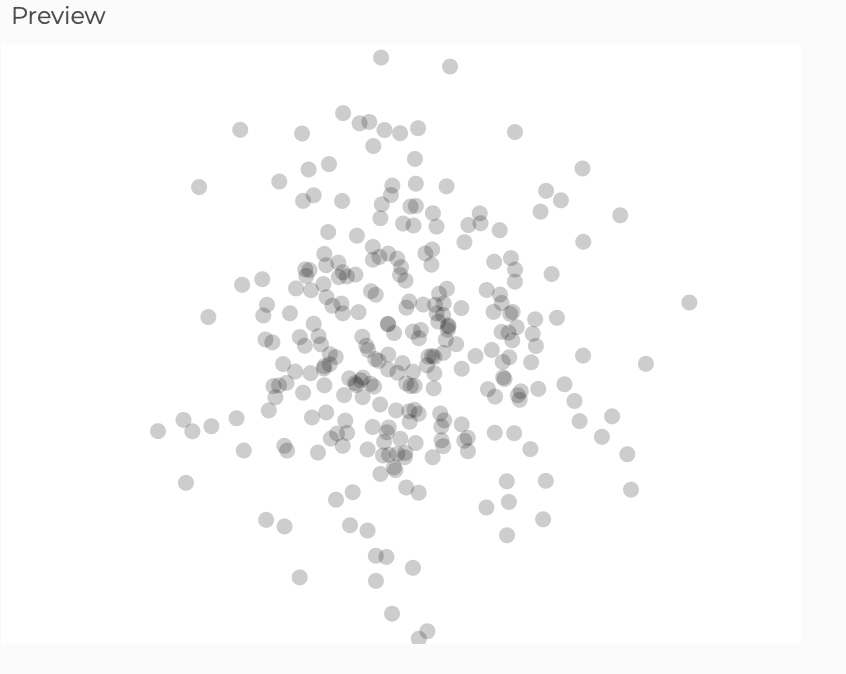

## Actividad 5

### 1. Código modificado

```js
let puntosGenerados = 0;
const maxPuntos = 500; // Número de puntos antes de limpiar

function setup() {
  createCanvas(400, 300);
  background(255);
  frameRate(30); // 
}

function draw() {
  if (puntosGenerados < maxPuntos) {
    let mediaX = width / 2;
    let desviacionEstandarX = 50;
    let mediaY = height / 2;
    let desviacionEstandarY = 50;

    let x = randomGaussian() * desviacionEstandarX + mediaX;
    let y = randomGaussian() * desviacionEstandarY + mediaY;

    x = constrain(x, 0, width);
    y = constrain(y, 0, height);

    fill(0, 50); // Negro semi-transparente
    noStroke();
    ellipse(x, y, 8, 8);

    puntosGenerados++;
  } else {
    background(255); // Limpia el fondo
    puntosGenerados = 0; // Reinicia el contador
  }
}
```

### 2. Screenshot resultado



### 3. Explicación breve

**En mi visualización:**

**Puntos Aleatorios:** Cada círculo se posiciona según dos números aleatorios generados con randomGaussian(), que siguen una distribución normal.

**Agrupación en la Media:** Los círculos se agrupan más cerca del centro, donde la probabilidad es más alta, reflejando que los valores cercanos a la media son más comunes.

**Disminución Gradual:** La densidad de círculos disminuye a medida que nos alejamos del centro, ya que los valores más alejados de la media son menos probables.

**Construcción de la Curva:** A medida que se agregan más círculos, la forma general se asemeja a la curva de campana de la distribución normal, con áreas de mayor densidad más oscuras por la superposición de círculos semitransparentes.

Esta visualización muestra cómo se distribuyen los valores según la distribución normal, con más puntos en el centro y menos hacia los bordes.
