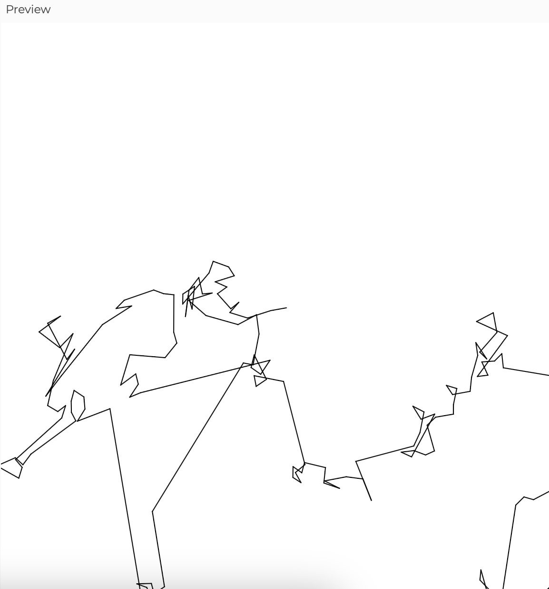

## Actividad 6

### 1. Código con Lévy Flight

```js
let walker;

function setup() {
  createCanvas(600, 600);
  background(255);
  walker = new Walker();
}

function draw() {
  walker.step();
  walker.show();
}

class Walker {
  constructor() {
    this.pos = createVector(width / 2, height / 2);
    this.prevPos = this.pos.copy();
  }

  step() {
    let step = p5.Vector.random2D(); // Dirección aleatoria
    let r = this.levy(); // Distancia del paso según Lévy
    step.setMag(r);

    this.prevPos.set(this.pos);
    this.pos.add(step);
  }

  show() {
    stroke(0);
    strokeWeight(1);
    line(this.prevPos.x, this.prevPos.y, this.pos.x, this.pos.y);
  }

  levy() {
    let beta = 1.5; // Ajusta la distribución de Lévy
    let num = pow(random(1), -1 / beta);
    return num * 10; // Escala para generar saltos largos ocasionales
  }
}
```

### 2. Screenshot resultado



### 3. Qué es un Lévy Flight y cuando es útil

**¿Qué es?**
Un Lévy Flight es un tipo de caminata aleatoria en la que la distancia de los pasos sigue una distribución de Lévy, caracterizada por muchos movimientos cortos y algunos saltos largos ocasionales. Esto crea trayectorias fractales y exploraciones eficientes en grandes espacios.

**¿Cuándo es útil?**
Se aplica en modelos de búsqueda óptima, como:

- Movimientos animales (depredadores buscando presas).
- Dispersión de partículas en medios turbulentos.
- Optimización y algoritmos de búsqueda en inteligencia artificial.
- Modelado financiero, como fluctuaciones bursátiles extremas.
