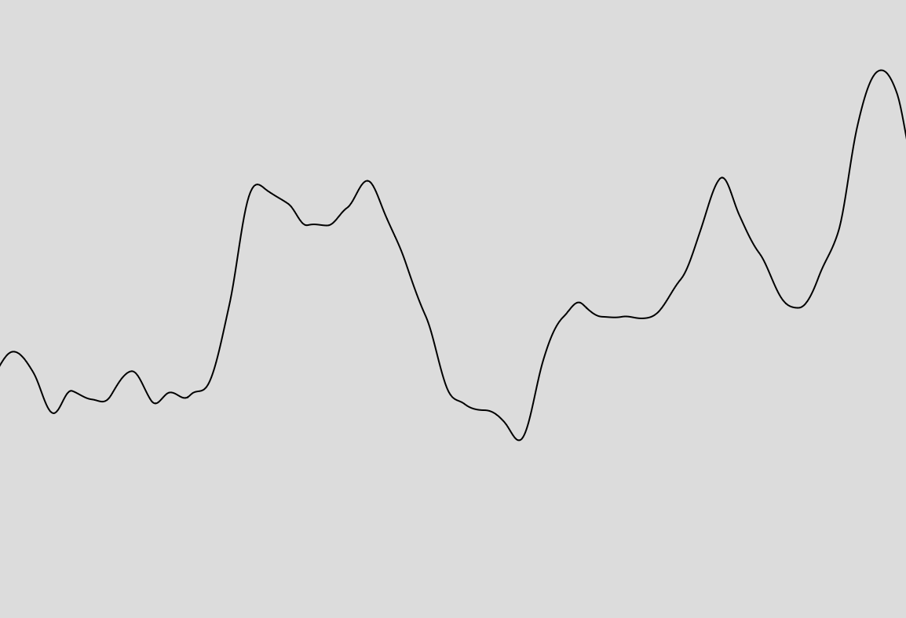

## Actividad 7 - Ruido Perlin

**1. Explicación figura 0.4:** La figura 0.4 compara dos tipos de secuencias de valores con el tiempo. A la izquierda, el ruido Perlin genera cambios suaves y continuos, formando una curva fluida sin saltos bruscos. A la derecha, el ruido aleatorio puro cambia de manera abrupta, creando una gráfica caótica y desordenada.

El ruido Perlin es ideal para simular cosas naturales como terrenos, texturas o animaciones porque las transiciones son graduales en lugar de repentinas.

**2.** Para esta aplicación, usé la función noise() para generar ruido Perlin. La clave para lograr variaciones suaves es avanzar progresivamente con un "tiempo" o índice en noise(), en lugar de usar valores aleatorios. En el código, incremento un valor llamado xoff en pequeños pasos, y cada llamada a noise(xoff) genera una nueva coordenada y para dibujar una curva con transiciones suaves.

**3. El código:**

```js
let xoff = 0;

function setup() {
  createCanvas(600, 400);
  background(220);
}

function draw() {
  background(220);
  noFill();
  stroke(0);
  beginShape();
  
  let xoffTemp = xoff;
  for (let x = 0; x < width; x++) {
    let y = noise(xoffTemp) * height; // Genera variaciones suaves en y
    vertex(x, y);
    xoffTemp += 0.01; // Paso de ruido
  }
  
  endShape();
  xoff += 0.01; // Desplazamiento en el tiempo para la animación
}

```

**4. Screenshot resultado:**


