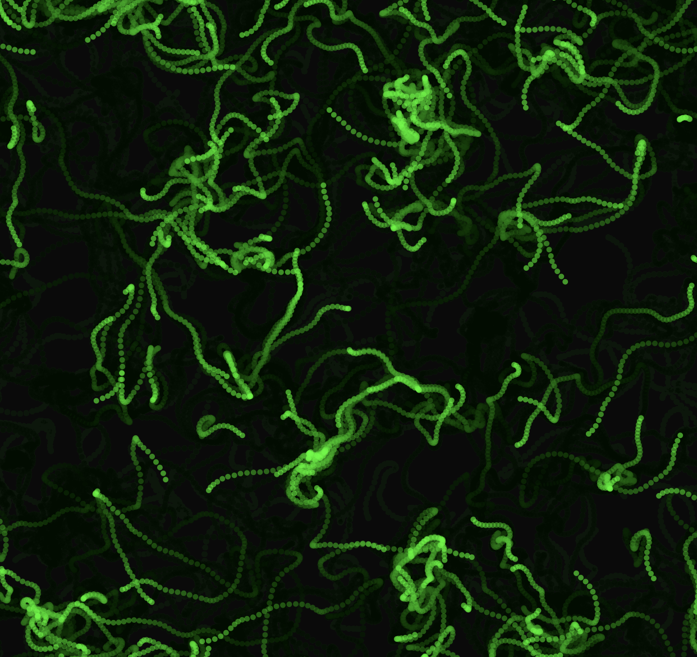
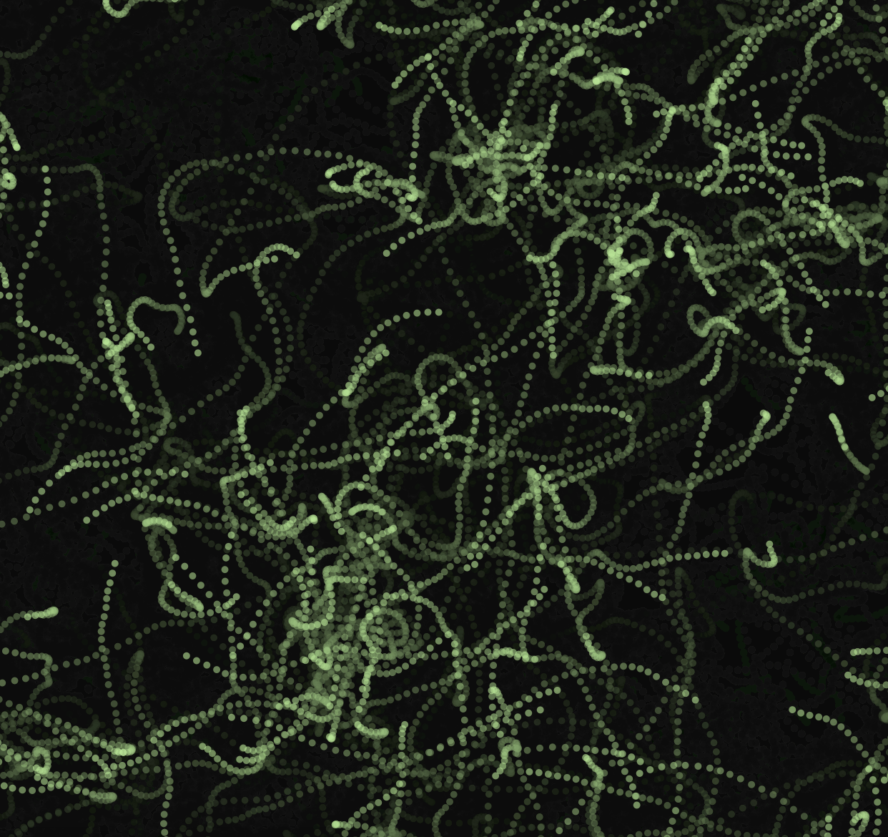
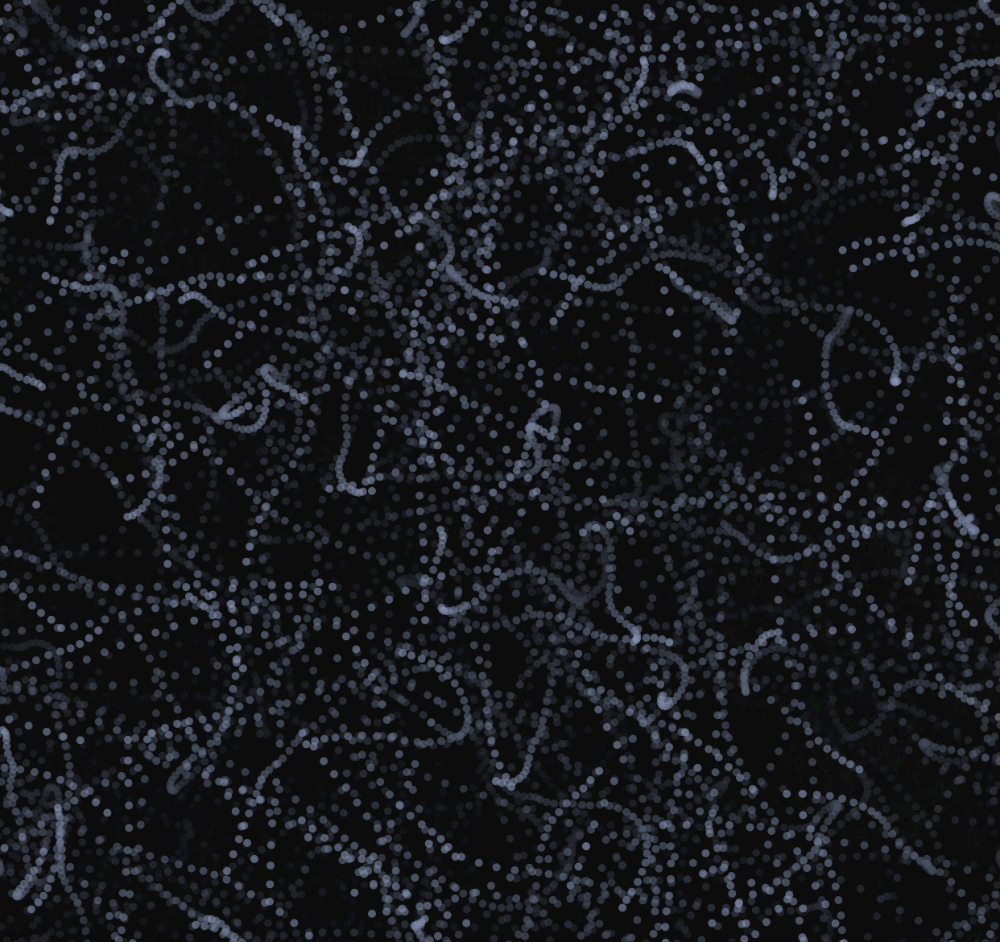

## Resultado aplicación interactiva

**1. Código de la aplicación:**

```js
let particles = [];
let noiseScale = 0.02;
let speedIncrement = 1;
let currentColor;

function setup() {
  createCanvas(windowWidth, windowHeight);
  currentColor = color(0, 255, 0, 150); // Color inicial verde
  for (let i = 0; i < 200; i++) {
    particles.push(new Particle());
  }
}

function draw() {
  background(0, 10); // Deja rastros sutiles
  
  for (let p of particles) {
    p.update();
    p.display();
  }
}

function mousePressed() {
  speedIncrement += 0.5; // Aumenta la velocidad con cada clic
  currentColor = color(random(100, 255), random(100, 255), random(100, 255), 150); // Cambia el color globalmente
  for (let p of particles) {
    p.color = currentColor;
    p.maxSpeed += 0.5;
  }
}

class Particle {
  constructor() {
    this.pos = createVector(random(width), random(height));
    this.vel = createVector(0, 0);
    this.acc = createVector(0, 0);
    this.maxSpeed = random(2, 5);
    this.color = currentColor;
  }

  update() {
    let angle = noise(this.pos.x * noiseScale, this.pos.y * noiseScale) * TWO_PI * 4;
    let force = p5.Vector.fromAngle(angle);
    
    // Influencia del mouse
    let mouseForce = createVector(mouseX - this.pos.x, mouseY - this.pos.y);
    mouseForce.setMag(0.05);
    
    this.acc.add(force);
    if (mouseIsPressed) this.acc.add(mouseForce);
    
    this.vel.add(this.acc);
    this.vel.limit(this.maxSpeed + speedIncrement);
    this.pos.add(this.vel);
    this.acc.mult(0);

    this.edges();
  }

  edges() {
    if (this.pos.x > width) this.pos.x = 0;
    if (this.pos.x < 0) this.pos.x = width;
    if (this.pos.y > height) this.pos.y = 0;
    if (this.pos.y < 0) this.pos.y = height;
  }

  display() {
    fill(this.color);
    noStroke();
    ellipse(this.pos.x, this.pos.y, 5, 5);
  }
}

```

**2. Capturas del contenido generado:**

- 0 clics


- 4 clics


- 8 clics

