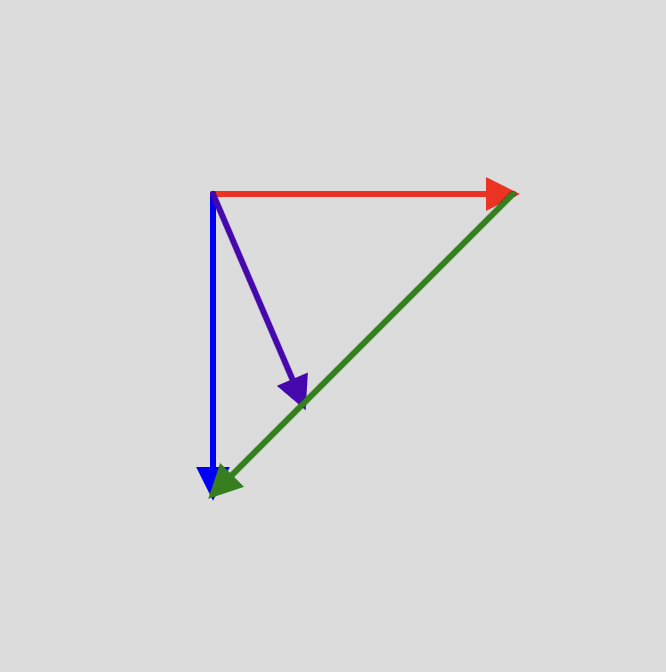

## Interpolación

**1. Código**

```js
let v0, v1, v2, t, dir;

function setup() {
  createCanvas(600, 600);
  v0 = createVector(width / 2, height / 2);
  v1 = createVector(150, 0);  
  v2 = createVector(0, 150);
  t = 0;
  dir = 0.02;
}

function draw() {
  background(220);

  // Dibujar vectores base
  drawArrow(v0, v1, 'red');
  drawArrow(v0, v2, 'blue');

  // Calcular vector interpolado
  let v3 = p5.Vector.lerp(v1, v2, t);
  let col = lerpColor(color('red'), color('blue'), t);
  drawArrow(v0, v3, col);

  // **Flecha verde**: conecta el extremo de la flecha roja con la azul
  let greenStart = p5.Vector.add(v0, v1);
  let greenEnd = p5.Vector.add(v0, v2);
  let greenVec = p5.Vector.sub(greenEnd, greenStart);
  drawArrow(greenStart, greenVec, 'green');

  // Animación de t en un ciclo de ida y vuelta
  t += dir;
  if (t >= 1 || t <= 0) {
    dir *= -1;
  }
}

function drawArrow(base, vec, myColor) {
  push();
  stroke(myColor);
  strokeWeight(3); // Flechas más delgadas
  fill(myColor);
  translate(base.x, base.y);
  
  // Dibuja la línea de la flecha
  line(0, 0, vec.x, vec.y);

  // Rota para alinear la punta de la flecha
  let angle = vec.heading();
  let arrowSize = 6; // Punta de flecha más pequeña
  translate(vec.x, vec.y);
  rotate(angle);

  // Dibuja el triángulo correctamente alineado y más pequeño
  triangle(-arrowSize * 2, arrowSize, -arrowSize * 2, -arrowSize, 0, 0);

  pop();
}
```




**2. ¿Cómo funciona lerp() y lerpColor()?**

- lerp() sirve para encontrar un punto intermedio entre dos valores. En este caso, lo usamos con vectores para que la flecha morada se mueva suavemente entre las otras dos flechas.

Si t = 0, el punto está en el primer vector.

Si t = 1, está en el segundo vector.

Con valores entre 0 y 1, la flecha se desplaza entre ambos.

- lerpColor() hace lo mismo, pero con colores.

La flecha morada cambia de color de rojo a azul mientras se mueve.

Dependiendo de la posición, el color se mezcla gradualmente.

**3. ¿Cómo se dibuja una flecha usando drawArrow()?**

La función drawArrow(base, vec, myColor) dibuja una flecha desde base hasta vec.

Para dibujar una flecha, primero trazamos una línea desde un punto de inicio hasta su destino. Luego, agregamos un triángulo en la punta para que realmente parezca una flecha.

- Dibujamos la línea desde el punto inicial hasta donde debe terminar.

- Giramos la punta en la dirección correcta.

- Dibujamos el triángulo en la punta para completar la forma de flecha.
