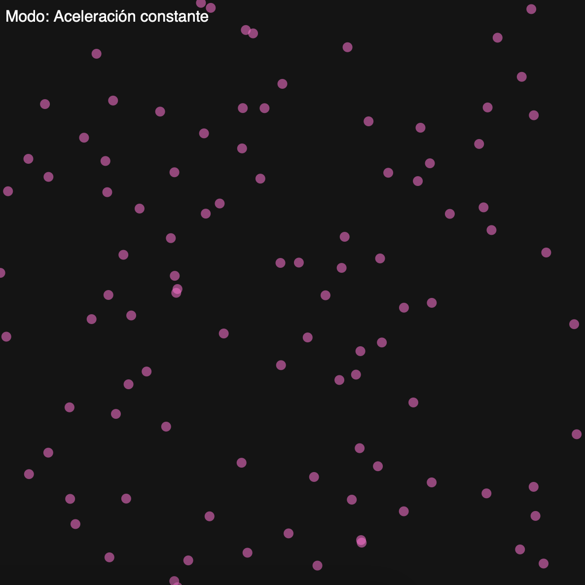
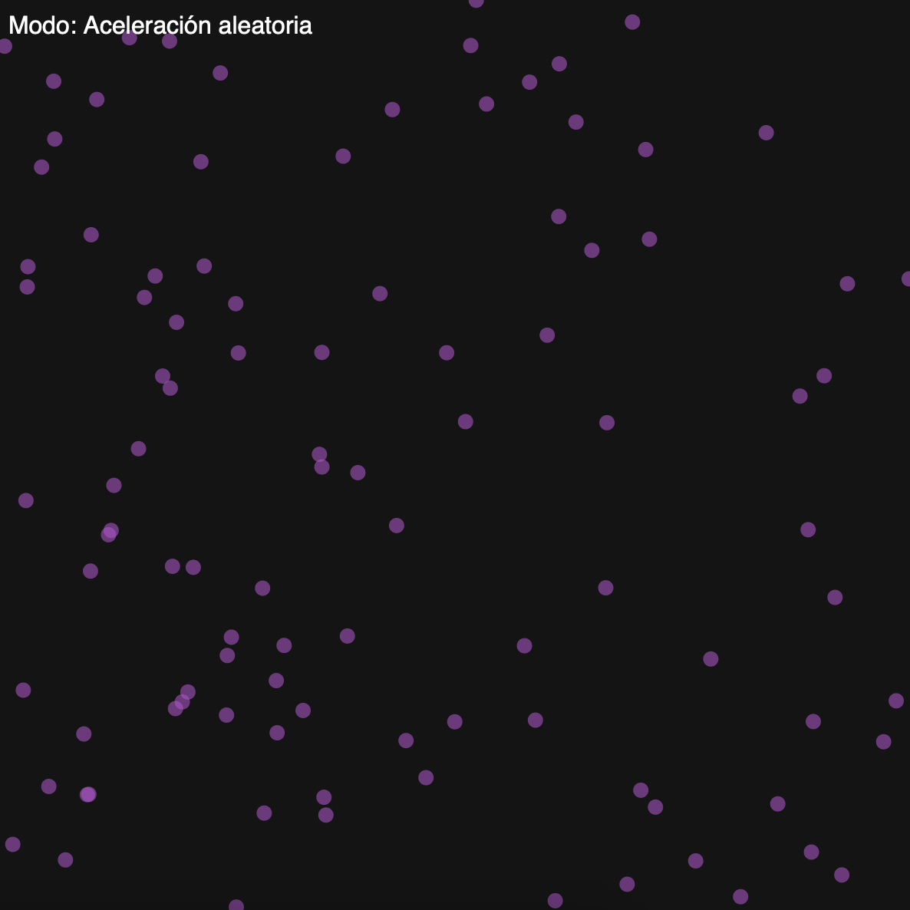
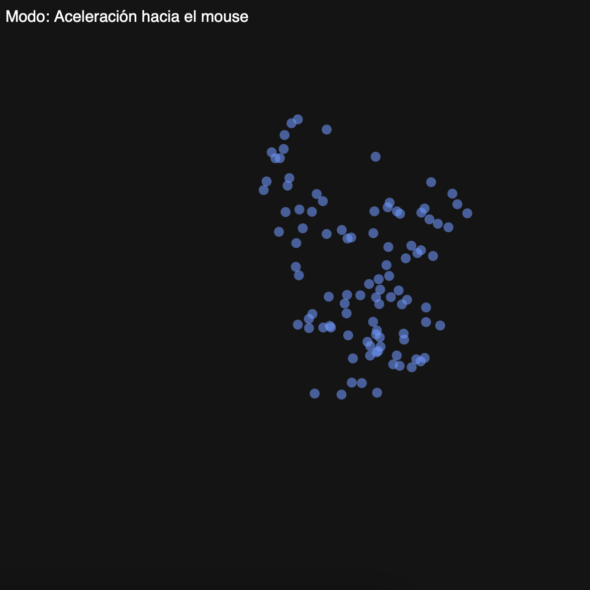

## Aplicación

**1. Código**

```js
let particles = [];
let mode = 0; // 0 = constante, 1 = aleatoria, 2 = hacia el mouse

function setup() {
  createCanvas(600, 600);
  for (let i = 0; i < 100; i++) {
    particles.push(new Particle(random(width), random(height)));
  }
}

function draw() {
  background(20);
  
  for (let p of particles) {
    p.update();
    p.show();
  }

  showMode();
}

function keyPressed() {
  if (key === '1') {
    mode = 0; // Aceleración constante
  } else if (key === '2') {
    mode = 1; // Aceleración aleatoria
  } else if (key === '3') {
    mode = 2; // Aceleración hacia el mouse
  }
}

class Particle {
  constructor(x, y) {
    this.position = createVector(x, y);
    this.velocity = p5.Vector.random2D();
    this.acceleration = createVector(0, 0);
  }

  update() {
    if (mode === 0) {
      this.acceleration.set(0.01, 0.01);
    } else if (mode === 1) {
      this.acceleration = p5.Vector.random2D().mult(0.1);
    } else if (mode === 2) {
      let mouse = createVector(mouseX, mouseY);
      let force = p5.Vector.sub(mouse, this.position);
      force.setMag(0.05);
      this.acceleration = force;
    }

    this.velocity.add(this.acceleration);
    this.velocity.limit(3);
    this.position.add(this.velocity);
    this.edges();
  }

  edges() {
    if (this.position.x > width) this.position.x = 0;
    if (this.position.x < 0) this.position.x = width;
    if (this.position.y > height) this.position.y = 0;
    if (this.position.y < 0) this.position.y = height;
  }

  show() {
    noStroke();
    
    // Cambiar color según el modo
    if (mode === 0) {
      fill(255, 100, 200, 150); // Rosado
    } else if (mode === 1) {
      fill(180, 80, 200, 150); // Morado
    } else if (mode === 2) {
      fill(100, 150, 255, 150); // Azul
    }

    ellipse(this.position.x, this.position.y, 10); // Círculos más grandes
  }
}

// Muestra el modo actual en pantalla
function showMode() {
  fill(255);
  textSize(16);
  textAlign(LEFT, TOP);
  let modeText = mode === 0 ? "Aceleración constante" :
                 mode === 1 ? "Aceleración aleatoria" :
                 "Aceleración hacia el mouse";
  text("Modo: " + modeText, 10, 10);
}
```

**2. Capturas del contenido generado**

  - Aceleración constante
   

  - Acelaración aleatoria
  

  - Aceleración hacia el mouse
  

**3. Cambios**

Solo hice un cambio, y es que ahora con cada cambio de modo de aceleración, las partículas cambian a un color específico con el modo.
