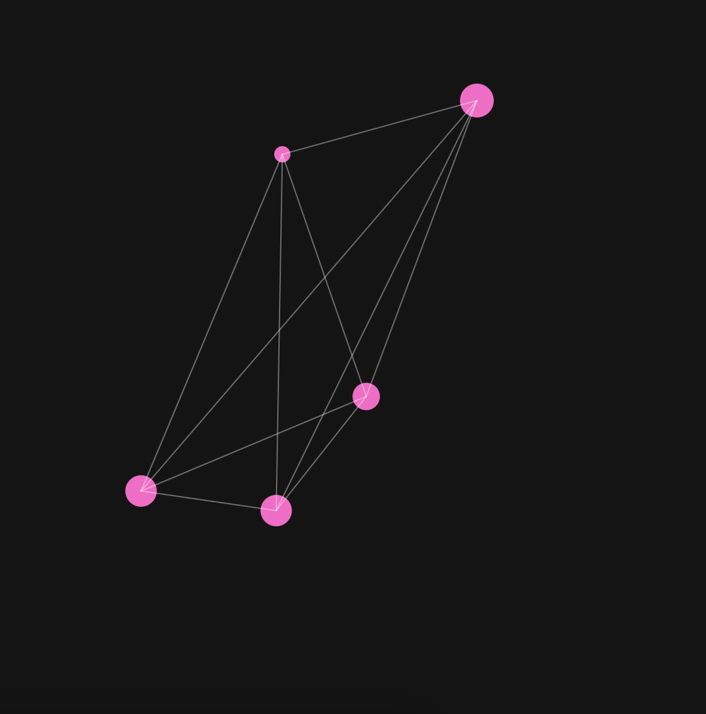

## n-cuerpos

**Link al editor p5.js:** https://editor.p5js.org/guille-ox/sketches/7jhXNwnI1

**1. ¿Cómo modelé el problema de los n-cuerpos?**

- Creé múltiples partículas que se comportan como cuerpos con masa en el espacio.

- Cada partícula ejerce una fuerza de atracción sobre las demás basada en la distancia y la "masa".

- Utilicé la Ley de Newton para calcular la aceleración resultante de cada partícula sumando todas las fuerzas aplicadas sobre ella.

- Agregué visuales inspirados en Calder, con líneas que conectan las partículas para dar una sensación de móviles en movimiento.

**2. Código**

```js
let particles = [];

function setup() {
  createCanvas(600, 600);
  for (let i = 0; i < 5; i++) { // Cinco cuerpos, como en un móvil de Calder
    particles.push(new Particle(random(width), random(height), random(5, 15)));
  }
}

function draw() {
  background(20);
  
  for (let p of particles) {
    p.applyForces(particles);
    p.update();
    p.show();
  }
  
  drawConnections(); // Dibujar líneas entre las partículas
}

class Particle {
  constructor(x, y, m) {
    this.position = createVector(x, y);
    this.velocity = createVector(random(-1, 1), random(-1, 1));
    this.acceleration = createVector(0, 0);
    this.mass = m;
  }

  applyForces(others) {
    for (let other of others) {
      if (other !== this) {
        let force = p5.Vector.sub(other.position, this.position);
        let distance = constrain(force.mag(), 5, 50);
        let strength = (this.mass * other.mass) / (distance * distance);
        force.setMag(strength);
        this.acceleration.add(force.div(this.mass));
      }
    }
  }

  update() {
    this.velocity.add(this.acceleration);
    this.velocity.limit(5);
    this.position.add(this.velocity);
    this.acceleration.mult(0);
  }

  show() {
    fill(255, 100, 200);
    noStroke();
    ellipse(this.position.x, this.position.y, this.mass * 2);
  }
}

function drawConnections() {
  stroke(255, 100);
  for (let i = 0; i < particles.length; i++) {
    for (let j = i + 1; j < particles.length; j++) {
      line(particles[i].position.x, particles[i].position.y,
           particles[j].position.x, particles[j].position.y);
    }
  }
}
```

**3. Screenshot resultado**


