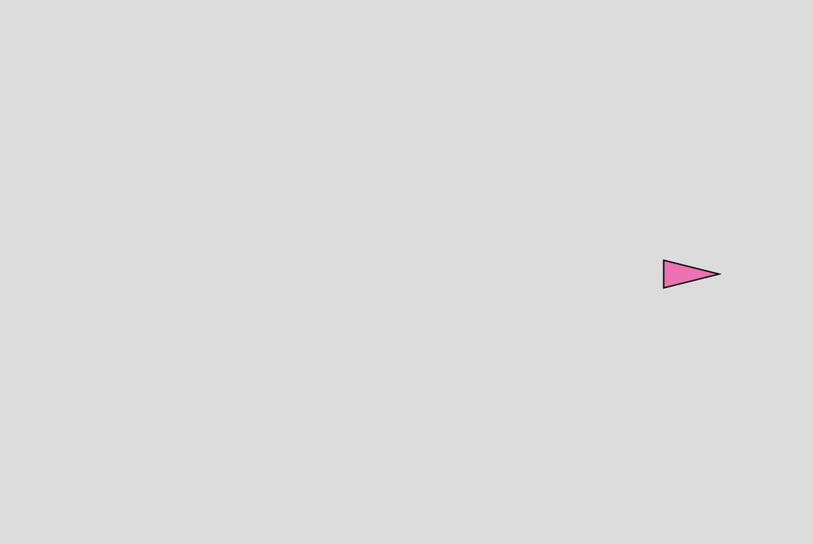
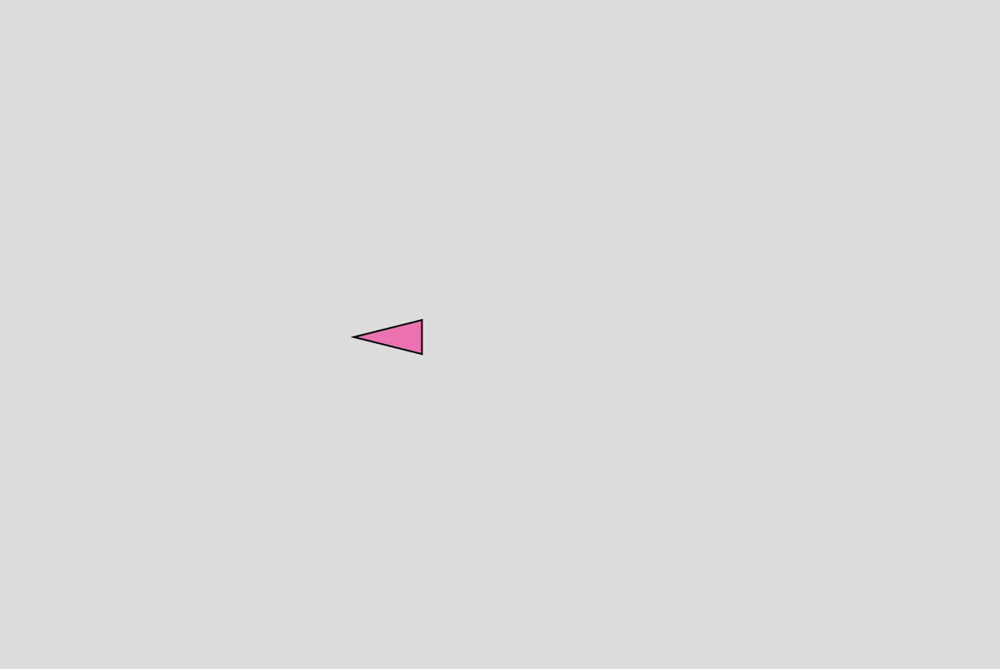

## Vehículo

**1. Link al editor:** https://editor.p5js.org/guille-ox/sketches/6dREVTGPkb

**2. Código**

```js
let vehicle;

function setup() {
  createCanvas(600, 400);
  vehicle = new Vehicle(width / 2, height / 2);
}

function draw() {
  background(220);

  vehicle.update();
  vehicle.edges();
  vehicle.display();
}

function keyPressed() {
  if (keyCode === LEFT_ARROW) {
    vehicle.applyForce(createVector(-0.3, 0)); // Aumenté la aceleración
  } else if (keyCode === RIGHT_ARROW) {
    vehicle.applyForce(createVector(0.3, 0)); // Aumenté la aceleración
  }
}

class Vehicle {
  constructor(x, y) {
    this.position = createVector(x, y);
    this.velocity = createVector(0, 0);
    this.acceleration = createVector(0, 0);
    this.angle = 0;
  }

  applyForce(force) {
    this.acceleration.add(force);
  }

  update() {
    this.velocity.add(this.acceleration);
    this.position.add(this.velocity);
    this.acceleration.mult(0); 

    if (this.velocity.mag() > 0) {
      this.angle = this.velocity.heading();
    }
  }

  edges() {
    if (this.position.x > width) {
      this.position.x = 0;
    } else if (this.position.x < 0) {
      this.position.x = width;
    }
  }

  display() {
    push();
    translate(this.position.x, this.position.y);
    rotate(this.angle);
    fill(255, 105, 180); // Color rosado
    stroke(0);
    
    // Triángulo equilátero
    let size = 20; // Tamaño del triángulo
    triangle(
      -size, size / 2,  // Punto inferior izquierdo
      -size, -size / 2, // Punto superior izquierdo
      size, 0          // Punta del triángulo
    );

    pop();
  }
}
```

**3. Screenshots resultados**




