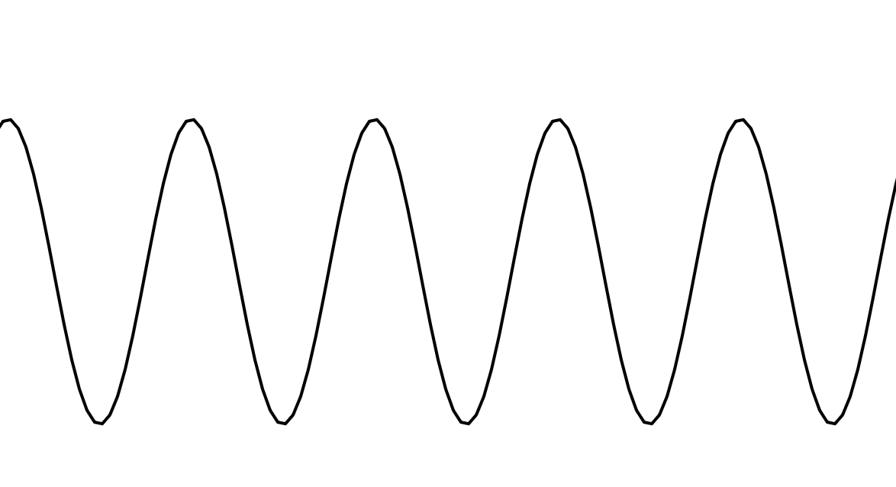
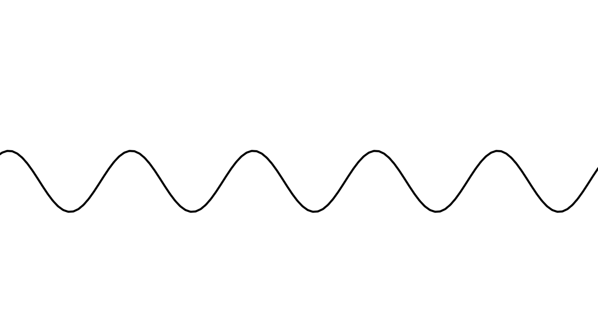

## Funciones sinusoides

**1. Link al editor:** https://editor.p5js.org/guille-ox/sketches/ANV6nIp4W

2. Código

  **-  Controles:**

  ⬆️ / ⬇️ → Cambiar amplitud (altura de la onda)
 
  ➡️ / ⬅️ → Cambiar periodo (longitud de la onda, afecta frecuencia)

  P → Ajustar fase (desplazamiento lateral de la onda)

  S / A → Aumentar/disminuir la velocidad de la animación

```js
let amplitude = 100; // Amplitud de la onda
let period = 120; // Periodo de la onda (afecta la frecuencia)
let phase = 0; // Fase inicial
let speed = 2; // Velocidad angular

function setup() {
  createCanvas(640, 360);
}

function draw() {
  background(255);
  stroke(0);
  strokeWeight(2);
  noFill();

  translate(0, height / 2); // Centrar la onda en el canvas

  beginShape();
  for (let x = 0; x < width; x += 5) {
    let angle = TWO_PI * (x / period) + phase; // Conversión a radianes
    let y = amplitude * sin(angle); // Función sinusoide
    vertex(x, y);
  }
  endShape();

  phase += speed * 0.01; // Ajustar fase para animación
}

// Controles para modificar los parámetros en tiempo real
function keyPressed() {
  if (keyCode === UP_ARROW) {
    amplitude += 10; // Aumentar amplitud
  } else if (keyCode === DOWN_ARROW) {
    amplitude -= 10; // Disminuir amplitud
  } else if (keyCode === RIGHT_ARROW) {
    period += 10; // Aumentar periodo (disminuye la frecuencia)
  } else if (keyCode === LEFT_ARROW) {
    period -= 10; // Disminuir periodo (aumenta la frecuencia)
  } else if (key === 'P' || key === 'p') {
    phase += PI / 8; // Ajustar fase
  } else if (key === 'S' || key === 's') {
    speed += 0.5; // Aumentar velocidad de animación
  } else if (key === 'A' || key === 'a') {
    speed -= 0.5; // Disminuir velocidad de animación
  }
}
```

**3. Captura simulación**



