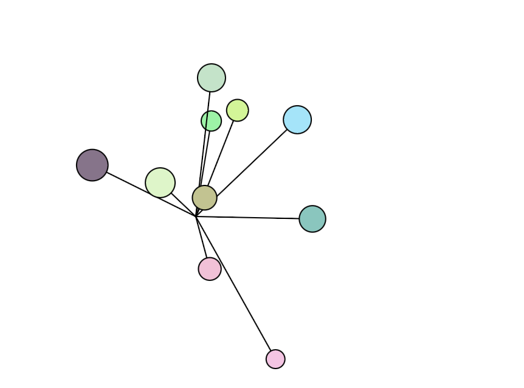

## Osciladores

**1. Link al editor:** https://editor.p5js.org/guille-ox/sketches/CMZ13aMmM

**2. Código**

```js
// The Nature of Code
// Daniel Shiffman
// http://natureofcode.com

let oscillators = [];
let gravity;

function setup() {
  createCanvas(640, 360);
  
  // Crear osciladores con valores más suaves
  for (let i = 0; i < 10; i++) {
    oscillators.push(new Oscillator(random(15, 30), random(0.005, 0.03)));
  }
  
  gravity = createVector(0, 0.001); // Gravedad más suave
}

function draw() {
  background(255);

  // Actualizar y mostrar osciladores
  for (let i = 0; i < oscillators.length; i++) {
    oscillators[i].applyForce(gravity);
    oscillators[i].update();
    oscillators[i].show();
  }
}

class Oscillator {
  constructor(size, speed) {
    this.angle = createVector(0, 0);
    this.velocity = createVector(random(-speed, speed), random(-speed, speed));
    this.amplitude = createVector(random(50, 120), random(50, 120));
    this.position = createVector(width / 2, height / 2);
    this.acceleration = createVector(0, 0);
    this.size = size;
    this.baseColor = color(random(100, 255), random(100, 255), random(100, 255));

    // Limite de velocidad para evitar aceleraciones descontroladas
    this.maxSpeed = speed * 3;
  }

  applyForce(force) {
    this.acceleration.add(force);
  }

  update() {
    this.velocity.add(this.acceleration);
    this.velocity.limit(this.maxSpeed); // Limita la velocidad máxima
    this.angle.add(this.velocity);
    this.acceleration.mult(0); // Reinicia aceleración en cada frame
  }

  show() {
    let x = sin(this.angle.x) * this.amplitude.x;
    let y = sin(this.angle.y) * this.amplitude.y;

    stroke(0);
    fill(this.baseColor);
    line(width / 2, height / 2, width / 2 + x, height / 2 + y);
    ellipse(width / 2 + x, height / 2 + y, this.size);
  }

  // Si se hace clic, el oscilador se reinicia a una velocidad normal
  reset() {
    this.velocity = createVector(random(-0.02, 0.02), random(-0.02, 0.02));
  }
}

// Detectar clic y reiniciar osciladores
function mousePressed() {
  for (let i = 0; i < oscillators.length; i++) {
    oscillators[i].reset();
  }
}
```

**3. Captura simulación**


