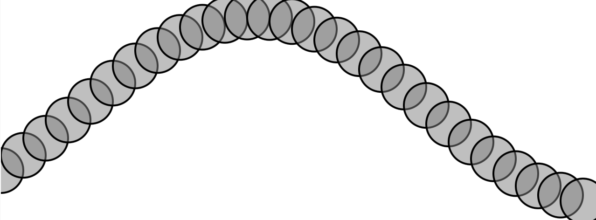
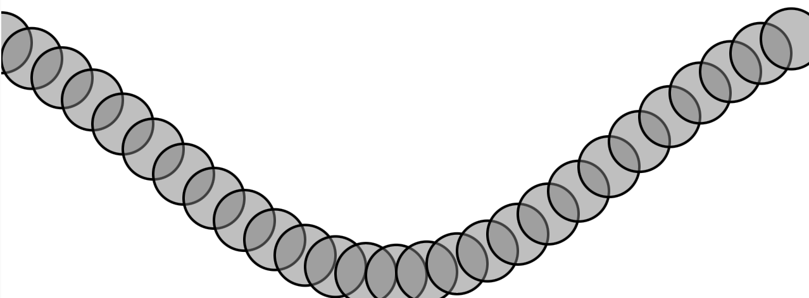

## Ondas

**1. Link al editor:** https://editor.p5js.org/guille-ox/sketches/hNja2g1hf

**2. Código**

```js
// The Nature of Code
// Daniel Shiffman
// http://natureofcode.com

let angle = 0;
let angleVelocity = 0.2;
let amplitude = 100;
let time = 0; // Variable para el desplazamiento horizontal

function setup() {
  createCanvas(640, 240);
}

function draw() {
  background(255);

  stroke(0);
  strokeWeight(2);
  fill(127, 127);

  let xSpacing = 24; // Espaciado entre los círculos
  let currentAngle = time; // Desfase en el tiempo

  for (let x = 0; x <= width; x += xSpacing) {
    // 1) Calcular la posición Y usando sin() y el ángulo actual
    let y = amplitude * sin(currentAngle);

    // 2) Dibujar el círculo en la posición (x, y)
    circle(x, y + height / 2, 48);

    // 3) Avanzar el ángulo para el siguiente punto de la onda
    currentAngle += angleVelocity;
  }

  // Mover la onda a la derecha con el tiempo
  time += 0.05;
}
```

**3. Captura simulación**



