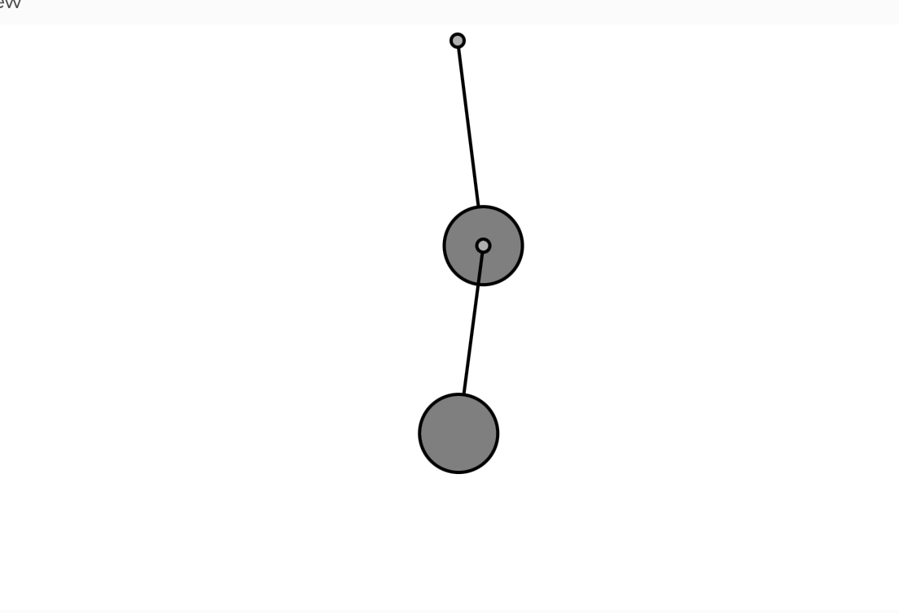

## Resortes

**1. Link al editor:** https://editor.p5js.org/guille-ox/sketches/a9Q7kbhcm

**2. Código**

```js
// The Nature of Code
// Daniel Shiffman
// http://natureofcode.com

let bob1, bob2;
let spring1, spring2;

function setup() {
  createCanvas(640, 360);
  
  // Primer resorte: anclado arriba
  spring1 = new Spring(width / 2, 10, 100);
  bob1 = new Bob(width / 2, 110);

  // Segundo resorte: conectado a bob1
  spring2 = new Spring(bob1.position.x, bob1.position.y, 100);
  bob2 = new Bob(width / 2, 210);
}

function draw() {
  background(255);

  let gravity = createVector(0, 2);
  bob1.applyForce(gravity);
  bob2.applyForce(gravity);

  // Actualizar y manejar la interacción con el mouse
  bob1.update();
  bob1.handleDrag(mouseX, mouseY);
  
  bob2.update();
  bob2.handleDrag(mouseX, mouseY);

  // Conectar los resortes
  spring1.connect(bob1);
  spring1.constrainLength(bob1, 30, 200);
  
  spring2.anchor = bob1.position; // ⚠️ Aquí conectamos el segundo resorte al primer bob
  spring2.connect(bob2);
  spring2.constrainLength(bob2, 30, 200);

  // Dibujar todo
  spring1.showLine(bob1);
  bob1.show();
  spring1.show();
  
  spring2.showLine(bob2);
  bob2.show();
  spring2.show();
}

function mousePressed() {
  bob1.handleClick(mouseX, mouseY);
  bob2.handleClick(mouseX, mouseY);
}

function mouseReleased() {
  bob1.stopDragging();
  bob2.stopDragging();
}

// 📌 Clase Bob (Masa)
class Bob {
  constructor(x, y) {
    this.position = createVector(x, y);
    this.velocity = createVector(0, 0);
    this.acceleration = createVector(0, 0);
    this.mass = 24;
    this.damping = 0.98;
    this.dragging = false;
  }

  applyForce(force) {
    let f = p5.Vector.div(force, this.mass);
    this.acceleration.add(f);
  }

  update() {
    if (!this.dragging) {
      this.velocity.add(this.acceleration);
      this.velocity.mult(this.damping);
      this.position.add(this.velocity);
      this.acceleration.mult(0);
    }
  }

  show() {
    fill(127);
    stroke(0);
    strokeWeight(2);
    circle(this.position.x, this.position.y, this.mass * 2);
  }

  handleClick(mx, my) {
    let d = dist(mx, my, this.position.x, this.position.y);
    if (d < this.mass) this.dragging = true;
  }

  handleDrag(mx, my) {
    if (this.dragging) {
      this.position.set(mx, my);
      this.velocity.set(0, 0);
    }
  }

  stopDragging() {
    this.dragging = false;
  }
}

// 📌 Clase Spring (Resorte)
class Spring {
  constructor(x, y, length) {
    this.anchor = createVector(x, y);
    this.restLength = length;
    this.k = 0.1;
  }

  connect(bob) {
    let force = p5.Vector.sub(this.anchor, bob.position);
    let stretch = force.mag() - this.restLength;

    force.setMag(stretch * this.k);
    bob.applyForce(force);
  }

  constrainLength(bob, minLength, maxLength) {
    let force = p5.Vector.sub(bob.position, this.anchor);
    let d = force.mag();

    if (d < minLength) {
      force.setMag(minLength);
      bob.position = p5.Vector.add(this.anchor, force);
      bob.velocity.mult(0);
    } else if (d > maxLength) {
      force.setMag(maxLength);
      bob.position = p5.Vector.add(this.anchor, force);
      bob.velocity.mult(0);
    }
  }

  show() {
    fill(175);
    stroke(0);
    strokeWeight(2);
    circle(this.anchor.x, this.anchor.y, 8);
  }

  showLine(bob) {
    stroke(0);
    strokeWeight(2);
    line(this.anchor.x, this.anchor.y, bob.position.x, bob.position.y);
  }
}
```

**3. Captura simulación**


