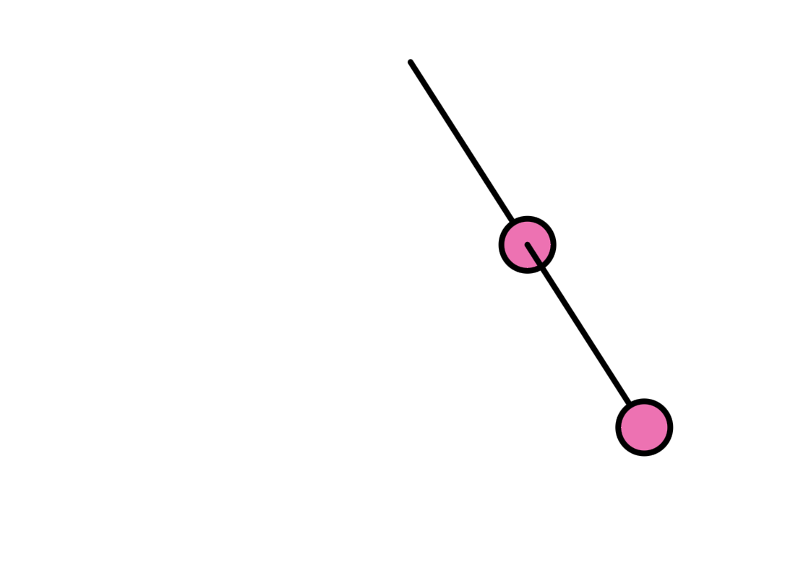

## Péndulos

**1. Link al editor:** https://editor.p5js.org/guille-ox/sketches/mlISfJJNd

**2. Código**

```js
// The Nature of Code
// Daniel Shiffman
// http://natureofcode.com

class Pendulum {
  constructor(originX, originY, length) {
    this.origin = createVector(originX, originY);
    this.position = createVector();
    this.length = length;
    this.angle = PI / 4;

    this.aVelocity = 0.0;
    this.aAcceleration = 0.0;
    this.damping = 0.995; // Simula resistencia del aire
    this.gravity = 0.4;

    this.dragging = false;
  }

  update() {
    if (!this.dragging) {
      let force = (-this.gravity / this.length) * sin(this.angle);
      this.aAcceleration = force;
      this.aVelocity += this.aAcceleration;
      this.aVelocity *= this.damping;
      this.angle += this.aVelocity;
    }
    
    this.position.set(
      this.origin.x + this.length * sin(this.angle),
      this.origin.y + this.length * cos(this.angle)
    );
  }

  show() {
    stroke(0);
    strokeWeight(4);
    fill(255, 105, 180); // Círculos rosados
    line(this.origin.x, this.origin.y, this.position.x, this.position.y);
    circle(this.position.x, this.position.y, 36); // 
  }

  clicked(mx, my) {
    let d = dist(mx, my, this.position.x, this.position.y);
    if (d < 18) { // Ajustado al nuevo tamaño
      this.dragging = true;
    }
  }

  stopDragging() {
    this.dragging = false;
  }

  drag() {
    if (this.dragging) {
      let diff = p5.Vector.sub(createVector(mouseX, mouseY), this.origin);
      this.angle = atan2(diff.x, diff.y);
    }
  }
}

let pendulum1;
let pendulum2;

function setup() {
  createCanvas(640, 500); //
  pendulum1 = new Pendulum(width / 2, 100, 150); // 
  pendulum2 = new Pendulum(0, 0, 150); // 
}

function draw() {
  background(255);
  
  pendulum1.update();
  pendulum1.show();
  pendulum1.drag();

  // El segundo péndulo se ancla a la posición del primero
  pendulum2.origin = pendulum1.position.copy();
  pendulum2.update();
  pendulum2.show();
  pendulum2.drag();
}

function mousePressed() {
  pendulum1.clicked(mouseX, mouseY);
  pendulum2.clicked(mouseX, mouseY);
}

function mouseReleased() {
  pendulum1.stopDragging();
  pendulum2.stopDragging();
}
```
**3. Captura simulación**



