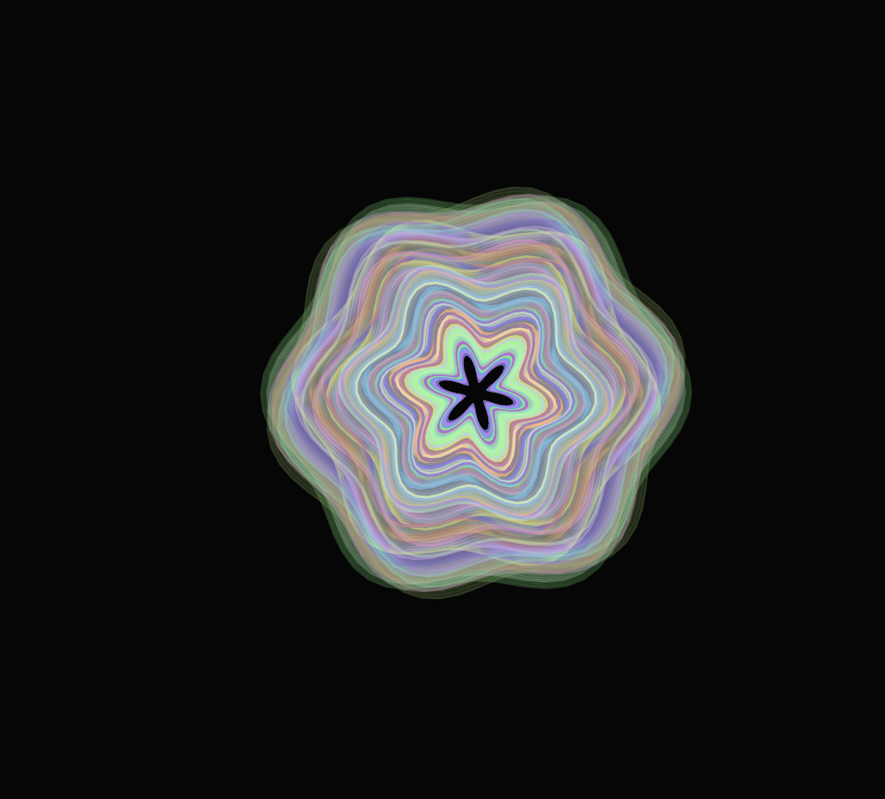

## Obra de arte generativa 

**0. Link al editor:** https://editor.p5js.org/guille-ox/sketches/D8VHAa8hq

**1. Idea de diseño**

La obra de arte generativa está inspirada en la relación entre el sonido y las ondas de energía. Cada vez que el micrófono detecta sonido, se generan ondas visuales que emergen y se expanden, creando un efecto similar al de las ondas en el agua. Cuando hay silencio total, el punto de origen cambia.

El objetivo es representar cómo el sonido transforma el entorno de manera dinámica e inesperada, combinando elementos de aleatoriedad y movimiento orgánico.

**2. Conceptos utilizados la Unidad 4**

**- Ondas y oscilaciones:** Se usa una función sinusoidal para distorsionar las ondas, dándoles un aspecto más natural y dinámico.

**- Coordenadas polares:** En lugar de dibujar las ondas con coordenadas cartesianas (x, y), se usa la fórmula polar (r * cos(θ), r * sin(θ)) para generar las formas circulares con distorsión sinusoidal.

**- Aleatoriedad:** Cuando hay silencio total, la próxima vez que haya sonido, las ondas emergen de un nuevo punto aleatorio en la pantalla.

**- Interactividad en tiempo real:** El micrófono captura sonido en vivo y lo traduce en visuales generativos instantáneamente.

**3. Código**

```js
let mic;
let waves = [];
let isSilent = true; // Bandera para detectar silencio total
let currentX, currentY; // Punto actual de inicio de las ondas

function setup() {
  createCanvas(800, 600);
  mic = new p5.AudioIn();
  mic.start();
  
  // Punto inicial aleatorio
  currentX = random(width);
  currentY = random(height);
}

function draw() {
  background(0, 20); // Fondo con leve transparencia para efecto de ecos

  let vol = mic.getLevel(); // Captura el volumen del micrófono
  let amplitude = map(vol, 0, 1, 10, 300); // Escalamos volumen a tamaño de onda

  // Detectar si hubo silencio total y luego sonido
  if (vol > 0.02 && isSilent) {
    currentX = random(width);
    currentY = random(height);
    isSilent = false;
  }

  // Si el volumen es muy bajo, activar estado de silencio total
  if (vol < 0.005) {
    isSilent = true;
  }

  // Generar nueva onda si el volumen supera cierto umbral
  if (vol > 0.02) {
    waves.push(new Wave(currentX, currentY, amplitude));
  }

  // Dibujar y actualizar todas las ondas
  for (let i = waves.length - 1; i >= 0; i--) {
    waves[i].update();
    waves[i].display();

    if (waves[i].alpha <= 0) {
      waves.splice(i, 1); // Eliminar ondas cuando desaparecen
    }
  }
}

// Clase para las ondas expansivas
class Wave {
  constructor(x, y, size) {
    this.x = x;
    this.y = y;
    this.size = size;
    this.angle = 0;
    this.speed = random(0.02, 0.05);
    this.alpha = 255;
    this.color = color(random(100, 255), random(100, 255), random(100, 255));
  }

  update() {
    this.size += 2; // Expansión gradual
    this.alpha -= 3; // Se desvanece con el tiempo
  }

  display() {
    noFill();
    stroke(this.color.levels[0], this.color.levels[1], this.color.levels[2], this.alpha);
    strokeWeight(2);

    // Dibujar la onda en coordenadas polares
    beginShape();
    for (let a = 0; a < TWO_PI; a += PI / 36) {
      let r = this.size + sin(a * 6 + this.angle) * 10; // Distorsión sinusoidal
      let x = this.x + r * cos(a);
      let y = this.y + r * sin(a);
      vertex(x, y);
    }
    endShape(CLOSE);

    this.angle += this.speed;
  }
}
```

**4. Captura simulación**




