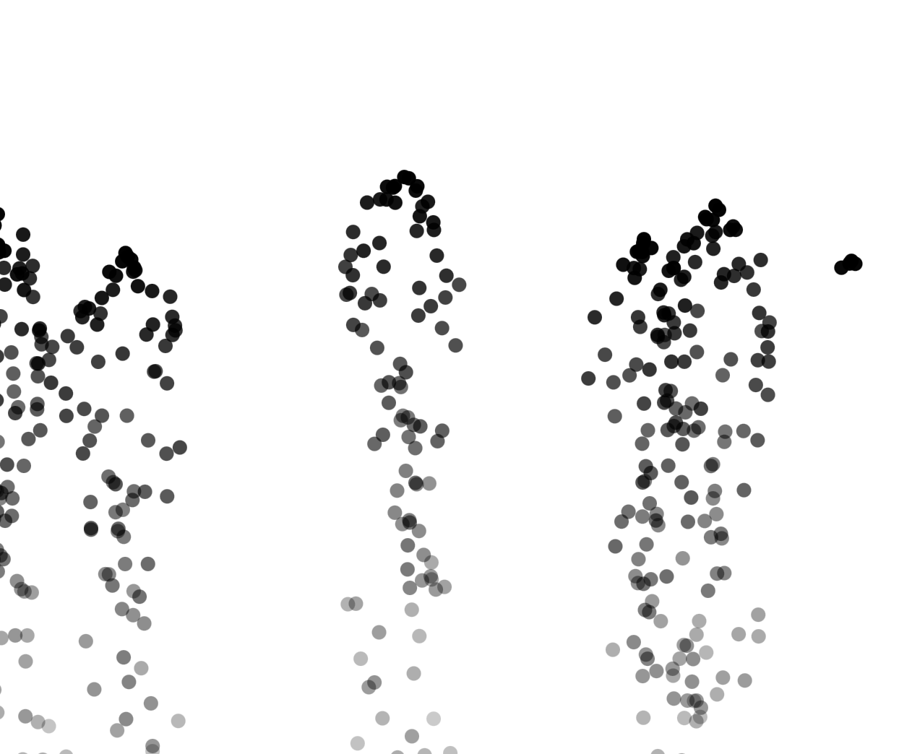

**0. Links al editor:**

  **- Ejemplo 4.2: An Array of Particles:** https://editor.p5js.org/guille-ox/sketches/jaf8MSOGj
 
  **- Ejemplo 4.4: A System of Systems:** https://editor.p5js.org/guille-ox/sketches/jDjvXxwEc

  **- Ejemplo 4.5: A Particle System with Inheritance and Polymorphism:** https://editor.p5js.org/guille-ox/sketches/2TXiZNIwW

  **- Ejemplo 4.6: A Particle System with Forces:** https://editor.p5js.org/guille-ox/sketches/eGz8M_xFG

  **- Ejemplo 4.7: A Particle System with a Repeller:** https://editor.p5js.org/guille-ox/sketches/KhY7p7Dny

## 1. Ejemplo 4.2: An Array of Particles

**- Gestión de creación y desaparición de partículas y manejo de memoria:**

En este ejemplo, se crea un array para almacenar múltiples partículas. En cada ciclo de dibujo (draw()), se añade una nueva partícula al array. Luego, se itera sobre el array para actualizar y mostrar cada partícula. Si una partícula ha "muerto" (es decir, su tiempo de vida ha llegado a cero), se elimina del array utilizando el método splice(). Esto asegura que la memoria se gestione adecuadamente al eliminar las partículas que ya no son necesarias.

**- Modificación propuesta: Incorporar el concepto de fuerzas (Unidad 2)**

Añadí una fuerza de gravedad que afecta a todas las partículas. Esto implica aplicar una fuerza constante hacia abajo en cada ciclo de dibujo.

**- Implementación:**

```js
let particles = [];
let gravity;

function setup() {
  createCanvas(800, 600);
  gravity = createVector(0, 0.1);
}

function draw() {
  background(255);

  // Añadir una nueva partícula en cada frame
  particles.push(new Particle(createVector(width / 2, 50)));

  // Iterar sobre el array de partículas
  for (let i = particles.length - 1; i >= 0; i--) {
    let p = particles[i];
    p.applyForce(gravity);
    p.update();
    p.display();
    if (p.isDead()) {
      particles.splice(i, 1);
    }
  }
}

class Particle {
  constructor(position) {
    this.position = position.copy();
    this.velocity = createVector(random(-1, 1), random(-2, 0));
    this.acceleration = createVector(0, 0);
    this.lifespan = 255;
  }

  applyForce(force) {
    this.acceleration.add(force);
  }

  update() {
    this.velocity.add(this.acceleration);
    this.position.add(this.velocity);
    this.acceleration.mult(0);
    this.lifespan -= 2;
  }

  display() {
    stroke(0, this.lifespan);
    fill(175, this.lifespan);
    ellipse(this.position.x, this.position.y, 12, 12);
  }

  isDead() {
    return this.lifespan < 0;
  }
}
```

**- Explicación:**

**Concepto aplicado:** Fuerzas (Unidad 2)

**Aplicación:** Se define un vector de gravedad que se aplica a cada partícula en cada ciclo de dibujo.

**Razón:** Incorporar fuerzas realistas mejora la simulación, haciendo que las partículas se comporten de manera más natural.

**- Captura de la simulación**


## 2. Ejemplo 4.4: A System of Systems

**- Gestión de creación y desaparición de partículas y manejo de memoria:**

En este ejemplo, se gestionan múltiples sistemas de partículas. Cada sistema de partículas es responsable de crear, actualizar y eliminar sus propias partículas. La memoria se gestiona eliminando partículas "muertas" de cada sistema y eliminando sistemas vacíos del array principal.

**- Modificación propuesta: Incorporar el concepto de oscilaciones (Unidad 3)**

Añadí una oscilación a la posición inicial de cada sistema de partículas para que se muevan de forma ondulatoria en la pantalla.

**- Implementación:**

```js
let systems = [];
let angle = 0;

function setup() {
  createCanvas(800, 600);
}

function draw() {
  background(255);

  // Añadir un nuevo sistema de partículas en una posición oscilante
  let x = width / 2 + sin(angle) * 100;
  let y = 50;
  systems.push(new ParticleSystem(createVector(x, y)));
  angle += 0.05;

  // Iterar sobre el array de sistemas de partículas
  for (let i = systems.length - 1; i >= 0; i--) {
    let ps = systems[i];
    ps.addParticle();
    ps.run();
    if (ps.isEmpty()) {
      systems.splice(i, 1);
    }
  }
}

class ParticleSystem {
  constructor(position) {
    this.origin = position.copy();
    this.particles = [];
  }

  addParticle() {
    this.particles.push(new Particle(this.origin));
  }

  run() {
    for (let i = this.particles.length - 1; i >= 0; i--) {
      let p = this.particles[i];
      p.update();
      p.display();
      if (p.isDead()) {
        this.particles.splice(i, 1);
      }
    }
  }

  isEmpty() {
    return this.particles.length === 0;
  }
}

class Particle {
  constructor(position) {
    this.position = position.copy();
    this.velocity = createVector(random(-1, 1), random(-2, 0));
    this.acceleration = createVector(0, 0);
    this.lifespan = 255;
  }

  update() {
    this.velocity.add(this.acceleration);
    this.position.add(this.velocity);
    this.acceleration.mult(0);
    this.lifespan -= 2;
  }

  display() {
    stroke(0, this.lifespan);
    fill(175, this.lifespan);
    ellipse(this.position.x, this.position.y, 12, 12);
  }

  isDead() {
    return this.lifespan < 0;
  }
}
```

**- Explicación:**

**Concepto aplicado:** Oscilaciones (Unidad 3)

**Aplicación:** Se utiliza una función seno para mover la posición inicial de cada sistema de partículas en un patrón oscilante.

**Razón:** Esto añade un movimiento dinámico y atractivo a la simulación, mostrando cómo las oscilaciones pueden integrarse en sistemas de partículas.

**- Captura de la simulación**



## 3. Ejemplo 4.5: A Particle System with Inheritance and Polymorphism

**- Gestión de creación y desaparición de partículas y manejo de memoria:**

En esta simulación, se crea un sistema de partículas con un atractor. La memoria se gestiona de la siguiente manera:

**Creación de Partículas:** Se genera una nueva partícula en cada ciclo draw(), en una posición aleatoria en la parte inferior de la pantalla.

**Aplicación de Fuerzas:** Cada partícula recibe una fuerza de atracción proveniente del atractor.

**Eliminación de Partículas:** Cada partícula tiene una vida útil (lifespan), que disminuye con el tiempo. Cuando lifespan llega a 0, la partícula se elimina del array particles[] para evitar acumulación innecesaria de memoria.

Esta gestión asegura que la simulación funcione de manera eficiente sin ralentizarse con el tiempo.

**- Modificación propuesta: Incorporar un atractor (Unidad 4)**

Se añadió un atractor que genera una fuerza de atracción sobre las partículas. Este atractor representa un punto en el espacio hacia el cual las partículas son atraídas.

_Fórmula aplicada:_

```js
force.mult(5 / (distance * distance)); 
```

Se calcula un vector de fuerza entre el atractor y la partícula.

Se normaliza el vector y se escala usando una relación inversa al cuadrado de la distancia.

Esto simula la atracción gravitacional o magnética.

**- Implementación:**

```js
let particles = [];
let attractor;

function setup() {
  createCanvas(800, 600);
  attractor = new Attractor(width / 2, height / 2);
}

function draw() {
  background(255);

  // Agregar una nueva partícula en cada frame
  particles.push(new Particle(createVector(random(width), height)));

  // Iterar sobre las partículas y aplicar la fuerza de atracción
  for (let i = particles.length - 1; i >= 0; i--) {
    let p = particles[i];

    // Aplicar la fuerza de atracción del atractor
    let force = attractor.attract(p);
    p.applyForce(force);

    p.update();
    p.display();

    // Eliminar partículas muertas
    if (p.isDead()) {
      particles.splice(i, 1);
    }
  }

  attractor.display();
}

class Particle {
  constructor(position) {
    this.position = position.copy();
    this.velocity = createVector(random(-2, 2), random(-2, 0));
    this.acceleration = createVector(0, 0);
    this.lifespan = 255;
    this.mass = 1; // Masa para calcular la atracción correctamente
  }

  applyForce(force) {
    let f = p5.Vector.div(force, this.mass); // Segunda ley de Newton: F = ma
    this.acceleration.add(f);
  }

  update() {
    this.velocity.add(this.acceleration);
    this.position.add(this.velocity);
    this.acceleration.mult(0);
    this.lifespan -= 2;
  }

  display() {
    stroke(0, this.lifespan);
    fill(0, this.lifespan);
    ellipse(this.position.x, this.position.y, 12, 12);
  }

  isDead() {
    return this.lifespan < 0;
  }
}

class Attractor {
  constructor(x, y) {
    this.position = createVector(x, y);
    this.G = 50; // Se aumenta la constante gravitacional
  }

  attract(particle) {
    let force = p5.Vector.sub(this.position, particle.position); // Dirección de la fuerza
    let distance = constrain(force.mag(), 10, 50); // Limitar distancia para evitar valores extremos
    force.normalize(); // Convertir a un vector unitario

    let strength = (this.G * particle.mass) / (distance * distance); // Ley de gravitación
    force.mult(strength);

    return force;
  }

  display() {
    fill(0, 255, 0);
    ellipse(this.position.x, this.position.y, 30, 30);
  }
}
```

**- Explicación:**

**Concepto aplicado:** Atractor (Unidad 4)

**Aplicación:** Se ha añadido una nueva clase Attractor, que genera una fuerza de atracción en cada partícula, haciéndolas moverse hacia su posición. Y también, se aplica una fuerza inversamente proporcional al cuadrado de la distancia para simular fenómenos naturales.

**Razón:** La atracción es un concepto fundamental en los sistemas de partículas, ya que permite modelar gravedad, magnetismo o incluso fluidos interactivos.
Este tipo de interacción añade realismo y dinamismo a la simulación.

**- Captura de la simulación:**


## 4. Ejemplo 4.6: A Particle System with Forces

**- Gestión de creación y desaparición de partículas y manejo de memoria:**

En este caso, las partículas son afectadas por fuerzas externas. Se manejan mediante un array y se eliminan cuando su tiempo de vida expira.

**- Modificación propuesta: Incorporar el concepto de ruido Perlin para modificar las trayectorias de las partículas (Unidad 2)**

Apliqué ruido Perlin a la aceleración de las partículas, haciendo que sus trayectorias sean más orgánicas y fluidas en lugar de lineales.

**- Implementación:**

```js
let particles = [];

function setup() {
  createCanvas(800, 600);
}

function draw() {
  background(255);

  particles.push(new Particle(createVector(width / 2, height / 2)));

  for (let i = particles.length - 1; i >= 0; i--) {
    let p = particles[i];
    p.applyPerlinNoise();
    p.update();
    p.display();
    if (p.isDead()) {
      particles.splice(i, 1);
    }
  }
}

class Particle {
  constructor(position) {
    this.position = position.copy();
    this.velocity = createVector(random(-1, 1), random(-1, 1));
    this.acceleration = createVector(0, 0);
    this.lifespan = 255;
    this.noiseOffset = random(1000);
  }

  applyPerlinNoise() {
    let noiseX = noise(this.noiseOffset) * 2 - 1;
    let noiseY = noise(this.noiseOffset + 100) * 2 - 1;
    this.acceleration = createVector(noiseX * 0.1, noiseY * 0.1);
    this.noiseOffset += 0.01;
  }

  update() {
    this.velocity.add(this.acceleration);
    this.position.add(this.velocity);
    this.lifespan -= 2;
  }

  display() {
    stroke(0, this.lifespan);
    fill(0, 100, 255, this.lifespan);
    ellipse(this.position.x, this.position.y, 12, 12);
  }

  isDead() {
    return this.lifespan < 0;
  }
}
```

**- Explicación**

**Concepto aplicado:** Ruido Perlin (Unidad 2)

**Aplicación:** Se usa ruido Perlin para generar variaciones suaves en la aceleración de las partículas, haciendo que se muevan de forma más natural.

**Razón:** El ruido Perlin crea movimientos más fluidos y orgánicos en comparación con valores aleatorios, simulando comportamientos más realistas.

**- Captura de la simulación:**


## 5. Ejemplo 4.7: A Particle System with a Repeller

**- Gestión de creación y desaparición de partículas y manejo de memoria:**

Este ejemplo introduce un objeto "repulsor" que genera una fuerza de repulsión en las partículas cercanas. Se maneja eliminando las partículas cuando su tiempo de vida expira.

**- Modificación propuesta: Incorporar el concepto de coordenadas polares para modificar el repulsor (Unidad 3)**

Hice que el repulsor no esté fijo, sino que se mueva en un patrón circular usando coordenadas polares.

**- Implementación:**

```js
let particles = [];
let repeller;
let angle = 0;

function setup() {
  createCanvas(800, 600);
  repeller = new Repeller(width / 2, height / 2);
}

function draw() {
  background(255);

  // Hacer que el repeller se mueva en un círculo
  let repellerX = width / 2 + cos(angle) * 100;
  let repellerY = height / 2 + sin(angle) * 100;
  repeller.setPosition(repellerX, repellerY);
  angle += 0.03;

  // Agregar una nueva partícula
  particles.push(new Particle(createVector(random(width), height)));

  for (let i = particles.length - 1; i >= 0; i--) {
    let p = particles[i];

    // Aplicar la fuerza de repulsión
    let force = repeller.repel(p);
    p.applyForce(force);

    p.update();
    p.display();

    if (p.isDead()) {
      particles.splice(i, 1);
    }
  }

  repeller.display();
}

class Particle {
  constructor(position) {
    this.position = position.copy();
    this.velocity = createVector(random(-1, 1), random(-2, 0));
    this.acceleration = createVector(0, 0);
    this.lifespan = 255;
    this.mass = 1; // Masa para mejorar el cálculo de la repulsión
  }

  applyForce(force) {
    let f = p5.Vector.div(force, this.mass);
    this.acceleration.add(f);
  }

  update() {
    this.velocity.add(this.acceleration);
    this.position.add(this.velocity);
    this.acceleration.mult(0);
    this.lifespan -= 2;
  }

  display() {
    stroke(0, this.lifespan);
    fill(0, this.lifespan);
    ellipse(this.position.x, this.position.y, 12, 12);
  }

  isDead() {
    return this.lifespan < 0;
  }
}

class Repeller {
  constructor(x, y) {
    this.position = createVector(x, y);
    this.strength = 150; // Ajustado para mayor repulsión
  }

  setPosition(x, y) {
    this.position.set(x, y);
  }

  repel(particle) {
    let force = p5.Vector.sub(particle.position, this.position);
    let distance = constrain(force.mag(), 10, 100); // Limita la distancia para evitar fuerzas infinitas
    force.normalize();

    let strength = this.strength / (distance * distance); // Ley de fuerza inversamente proporcional a la distancia
    force.mult(strength);

    return force;
  }

  display() {
    fill(255, 0, 0);
    ellipse(this.position.x, this.position.y, 30, 30);
  }
}
```

**- Explicación:**

**Concepto aplicado:** Coordenadas polares (Unidad 3)

**Aplicación:** Se usa cos() y sin() para hacer que el repulsor se mueva en un patrón circular.

**Razón:** Esto agrega dinamismo a la simulación, haciendo que las partículas sean repelidas de manera más impredecible.

**- Captura de la simulación:**


