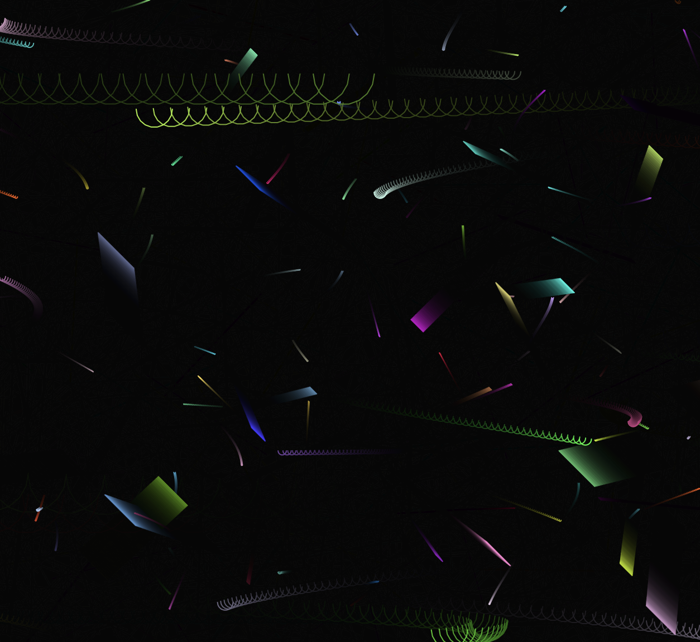

## Obra de arte generativa

**1. Link al editor:** https://editor.p5js.org/guille-ox/sketches/azIEBy1oO

**2. Idea**

Mi idea es generar una obra interactiva donde las formas dinámicas cambien en función del sonido captado por el micrófono y el usuario pueda alternar entre distintos tipos de visualización usando el teclado.

Inspirado en patrones generativos y arte visual reactivo, el sistema crea líneas y curvas que se deforman y oscilan en función del volumen del sonido ambiente.

**3. Código**

```js
let formas = [];
let mic;
let modo = 0; // 0: líneas, 1: curvas

function setup() {
  createCanvas(800, 600);
  mic = new p5.AudioIn();
  mic.start();
}

function draw() {
  background(0, 20); // Efecto de persistencia

  let vol = mic.getLevel(); // Obtener volumen del micrófono
  let amplitud = map(vol, 0, 1, 0, 200);

  // Crear nuevas formas según el modo activo
  let x = random(width);
  let y = random(height);
  
  if (modo === 0) {
    formas.push(new LíneaDinamica(x, y, amplitud));
  } else {
    formas.push(new CurvaOscilante(x, y, amplitud));
  }

  // Dibujar y actualizar formas
  for (let i = formas.length - 1; i >= 0; i--) {
    formas[i].actualizar();
    formas[i].mostrar();

    // Eliminar formas antiguas para gestionar memoria
    if (formas[i].tiempoDeVida <= 0) {
      formas.splice(i, 1);
    }
  }
}

// Cambio de modo con el teclado
function keyPressed() {
  if (key === ' ') {
    modo = (modo + 1) % 2;
  }
}

// Clase base
class FormaGenerativa {
  constructor(x, y) {
    this.pos = createVector(x, y);
    this.vel = p5.Vector.random2D();
    this.tiempoDeVida = 255;
    this.color = color(random(255), random(255), random(255));
  }

  actualizar() {
    this.pos.add(this.vel);
    this.tiempoDeVida -= 2;
  }

  mostrar() {
    stroke(this.color, this.tiempoDeVida);
    noFill();
  }
}

// Clase derivada: Línea Dinámica
class LíneaDinamica extends FormaGenerativa {
  constructor(x, y, amplitud) {
    super(x, y);
    this.longitud = amplitud;
  }

  mostrar() {
    super.mostrar();
    line(this.pos.x, this.pos.y, this.pos.x + this.longitud, this.pos.y + this.longitud);
  }
}

// Clase derivada: Curva Oscilante
class CurvaOscilante extends FormaGenerativa {
  constructor(x, y, amplitud) {
    super(x, y);
    this.amplitud = amplitud;
    this.frecuencia = random(0.02, 0.05);
    this.offset = random(TWO_PI);
  }

  actualizar() {
    super.actualizar();
    this.pos.x += sin(frameCount * this.frecuencia + this.offset) * this.amplitud;
  }

  mostrar() {
    super.mostrar();
    beginShape();
    for (let i = 0; i < 10; i++) {
      let angle = map(i, 0, 9, 0, PI);
      let x = this.pos.x + cos(angle) * this.amplitud;
      let y = this.pos.y + sin(angle) * this.amplitud;
      vertex(x, y);
    }
    endShape();
  }
}
```

**4. Conceptos aplicados de cada unidad**

**- Unidad 1: Movimiento y Transformaciones**

**✔ Concepto aplicado:** Uso de vectores para movimiento.

**✔ Aplicación:** Se utilizó p5.Vector para definir posición y dirección de las formas.

**✔ Razón:** Facilita el manejo de trayectorias dinámicas.

**- Unidad 2: Percepción e Interacción**

**✔ Concepto aplicado:** Entrada de datos del micrófono y teclado.

**✔ Aplicación:** Se usa p5.AudioIn() para capturar el volumen y keyPressed() para cambiar de modo.

**✔ Razón:** Permite que la obra reaccione en tiempo real al usuario.

**- Unidad 3: Persistencia y Memoria**

**✔ Concepto aplicado:** Gestión de memoria eliminando formas viejas.

**✔ Aplicación:** Se reduce el tiempoDeVida y se eliminan objetos del array cuando llegan a 0.

**✔ Razón:** Evita que el sistema se sobrecargue y mantiene el rendimiento.

**Unidad 4: Herencia y Polimorfismo**

**✔ Concepto aplicado:** Clases base y derivadas con métodos compartidos.

**✔ Aplicación:** FormaGenerativa es la clase padre, LíneaDinamica y CurvaOscilante la extienden.

**✔ Razón:** Facilita la creación de nuevas formas sin repetir código.

**5. Captura simulación**


