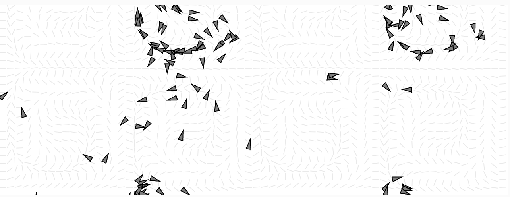

## Análisis del algoritmo de Flow Fields (Unidad 6 – Actividad 2)

**1. Estructura de datos del campo de flujo**
   
El campo de flujo se implementa como un array unidimensional (this.field) que almacena vectores (p5.Vector) en una cuadrícula virtual. Esta cuadrícula se define por:

```js
this.cols = número de columnas = width / resolution

this.rows = número de filas = height / resolution
```

Cada celda de la cuadrícula contiene un vector que indica la dirección del flujo en ese punto. Los índices se calculan como index = x + y * cols.

**2. Generación de los vectores**
   
En el código original, los vectores del campo se generaban con noise() para producir una apariencia natural y suave. En la versión modificada, usé una fórmula matemática:

```js
let angle = sin(x * 0.2) * cos(y * 0.2) * TWO_PI;
let v = p5.Vector.fromAngle(angle);
```

Esto genera patrones más ondulantes y geométricos, que crean un flujo más predecible y menos aleatorio. Al multiplicar por TWO_PI, el ángulo recorre un ciclo completo.

**3. Cómo el agente sigue el campo**

Cada agente (objeto Vehicle) utiliza el campo de flujo a través del método follow():

**- Ubicación en el campo:** el agente obtiene el vector que le corresponde mapeando su posición a la cuadrícula, usando lookup(this.position) del campo.

**- Cálculo de la fuerza de dirección:** 

    - El vector deseado se ajusta a la maxspeed del agente. 

    - Se calcula la diferencia entre el vector deseado y la velocidad actual (steer = desired - velocity).

    - Se limita esa fuerza con maxforce y se aplica al agente como aceleración.

Esto permite que el movimiento sea fluido y natural, ya que el agente se va corrigiendo gradualmente.

**4. Parámetros clave identificados**

**resolution:** controla el tamaño de cada celda del campo de flujo. A menor valor, mayor detalle.

  **- En la modificación:** 10 (más fino que el original, que era 20).

**maxspeed:** velocidad máxima de los agentes.

**maxforce:** fuerza máxima que puede aplicar un agente para cambiar de dirección.

**5. Modificación realizada y su efecto**

**- Cambios:**

Cambié la fórmula de generación de vectores, reemplazando noise() por sin(x) * cos(y):

```js
let angle = sin(x * 0.2) * cos(y * 0.2) * TWO_PI;
```

Reduje la resolución del campo de flujo a 10, lo cual aumenta la densidad de vectores.

**- Efecto observado:**

- El movimiento de los agentes se volvió más organizado y ondulante, como si todos siguieran un patrón de ondas en el espacio.

- Al tener más celdas por área (mayor resolución), los agentes reaccionan más frecuentemente a cambios en el campo, lo que les da un comportamiento más detallado.

- El resultado visual es una coreografía colectiva más fluida, donde los agentes parecen navegar en un campo dinámico, aunque el campo es estático.

**6. Captura:**


