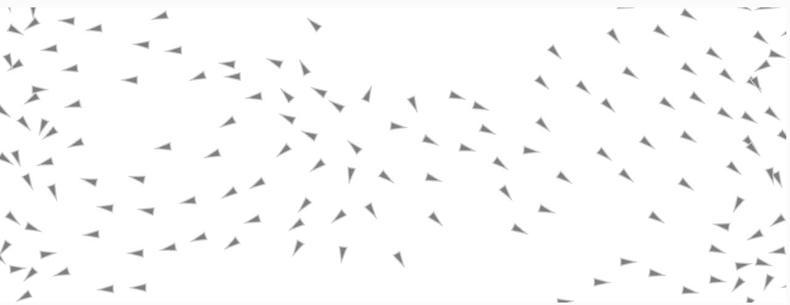

## Análisis del algoritmo de Flocking

**1. Reglas del Flocking**

**1.1. Separación (Separation)**

**- Objetivo:** Evitar que los boids se acerquen demasiado unos a otros.

**- Lógica:** Cada boid detecta a sus vecinos cercanos dentro de un radio (desiredSeparation = 25). Si hay otros boids dentro de esa distancia, calcula un vector que lo aleje de cada uno de ellos, invirtiendo la dirección y dividiendo por la distancia (para que los más cercanos lo repelan más fuerte). Luego promedia esos vectores y los transforma en una fuerza de dirección.

**- Resultado:** El boid se aleja si siente que hay demasiados vecinos cerca, ayudando a evitar el hacinamiento.

**1.2. Alineación (Alignment)**

**- Objetivo:** Hacer que cada boid se mueva en la misma dirección que los boids cercanos.

**- Lógica:** Cada boid busca a sus vecinos en un radio (neighbordist = 50), promedia sus velocidades y ajusta la suya propia hacia ese promedio usando una fuerza de steering.

**- Resultado:** Se logra un movimiento más coherente del grupo, como si todos giraran en la misma dirección.

**1.3. Cohesión (Cohesion)**

**- Objetivo:** Hacer que los boids se mantengan unidos como grupo.

**- Lógica:** Cada boid calcula el centro promedio de los boids cercanos (su centroide) y luego aplica una fuerza tipo seek para acercarse a ese punto.

**- Resultado:** El boid se siente atraído por el grupo, ayudando a mantener la "bandada" unida.

**2. Parámetros clave identificados**

**Parámetro | Valor en el código | Función**

desiredSeparation | 25.0 | Radio para calcular separación. Evita el hacinamiento.

neighbordist | 50.0 | Radio para calcular cohesión y alineación. Define los "vecinos".

maxspeed | 3 | Velocidad máxima de cada boid.

maxforce | 0.05 | Fuerza máxima que un boid puede aplicar (limita cambios bruscos).

sep.mult() | 2.5 (modificado) | Peso de la regla de separación.

ali.mult() | 1.0 | Peso de la regla de alineación.

coh.mult() | 0.5 (modificado) | Peso de la regla de cohesión.

**3. Modificación realizada**

Se alteraron los pesos de las fuerzas para experimentar con el comportamiento del enjambre:

```js
sep.mult(2.5);  // Separación aumentada
ali.mult(1.0);  // Alineación sin cambios
coh.mult(0.5);  // Cohesión reducida
```

**- Efecto observado:** 

- Los boids se mantienen más separados entre sí, creando grupos más pequeños y menos compactos.

- Al reducir la cohesión, ya no tienden a agruparse en una gran bandada, sino que se dispersan de forma más libre.

- La alineación constante mantiene cierto nivel de coordinación, pero con movimientos más sueltos y menos rígidos.

- El movimiento resultante es más caótico, dinámico y natural, similar a un grupo de peces asustados o aves en un espacio amplio.

**4. Captura:**


